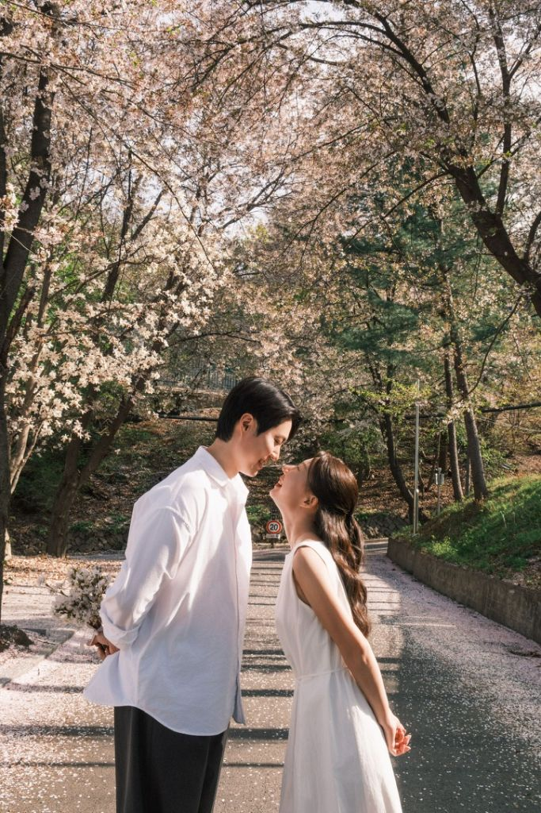
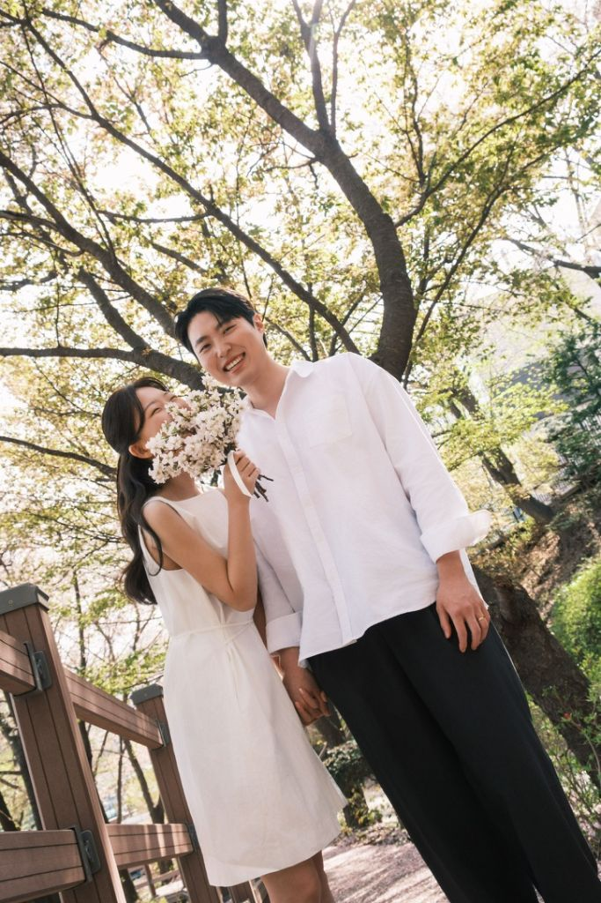
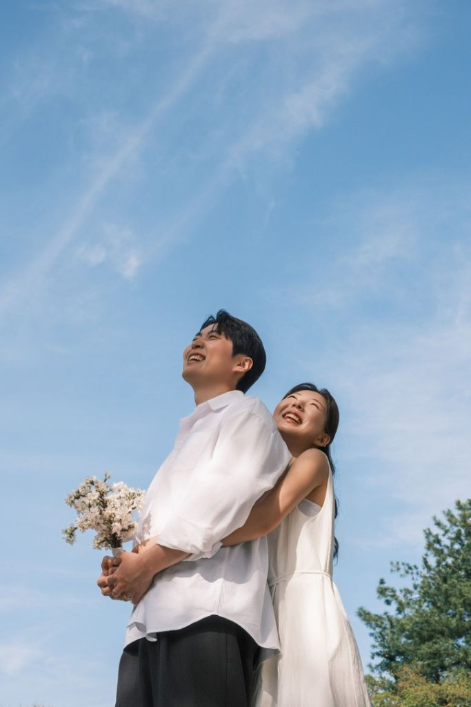
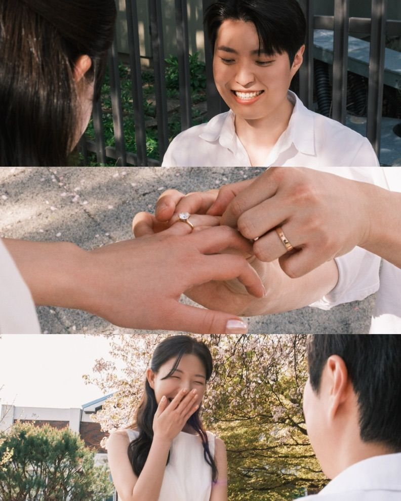

# 💌 이재민 ♥ 강지수 청첩장 - 배포 폴더

이 폴더 전체를 https://app.netlify.com/drop 에 드래그하면 배포됩니다.

---

## 📁 파일 구조

```
dist/
├─ index.html            ← 청첩장 기본 버전
├─ large.html            ← 청첩장 큰 글씨 버전 (부모님 지인용)
├─ admin.html            ← 신랑신부 전용 관리자 페이지 (비번: 1011)
├─ firebase-config.js    ← RSVP/방명록 DB 연결
├─ styles.css            ← 스타일시트
├─ styles-large.css      ← 큰 글씨 버전 스타일
└─ assets/
   ├─ og-image.jpg       ← 🔥 카톡 공유 썸네일 (교체 가능)
   ├─ bgm.mp3            ← 🔥 배경 음악 (여기에 파일 넣으면 자동 재생)
   └─ photos/
      ├─ cover-stairs-cropped.jpg  ← 표지 (하트 안) 사진
      ├─ cherry-face.jpg           ← 봉투 우표 & 갤러리 & 엔딩 우표
      ├─ cherry-kiss.jpg           ← 갤러리 1번째 (큰 사진)
      ├─ cherry-bouquet.jpg        ← 갤러리 2번째 (왼쪽)
      ├─ sky-01.jpg                ← 갤러리 2번째 (오른쪽)
      ├─ proposal-triptych.jpg     ← 갤러리 3번째 (큰 세로)
      ├─ stairs-01.jpg             ← 갤러리 4번째 (왼쪽)
      ├─ stairs-02.jpg             ← 갤러리 4번째 (오른쪽)
      ├─ cherry-road.jpg           ← 갤러리 5번째 (큰 사진)
      ├─ buckwheat-kiss.jpg        ← 갤러리 6번째 (오른쪽)
      ├─ buckwheat-lift.jpg        ← 갤러리 7번째 (가로)
      ├─ hydrangea-strip.jpg       ← 마지막 우표 프레임 (수국 5컷)
      ├─ map-real.jpg              ← 오시는 길 지도
      └─ heart-mask-v2.png         ← 하트 마스크 (건드리지 마세요)
```

---

## 🖼️ 갤러리 사진 자유롭게 추가/삭제 (자동 감지)

`assets/gallery/` 폴더 안의 사진들이 청첩장 갤러리에 **abc 순서대로** 자동 표시됩니다.

### 사진 추가/삭제 하는 법

**방법 A. 간단하게 (매니페스트 사용 안 함)**
1. `assets/gallery/manifest.txt` 파일을 **삭제**
2. 폴더에 `a.jpg`, `b.jpg`, `c.jpg` … 이런 이름으로 사진을 넣기
3. 다시 Netlify에 폴더 통째로 드래그
4. → **a → b → c 순서**로 자동 표시됨
5. 사진을 빼려면 파일만 삭제, 추가하려면 다음 알파벳 이름으로 넣으면 됨
6. 지원 확장자: `.jpg`, `.jpeg`, `.png`, `.webp`

**방법 B. 세밀 제어 (매니페스트 사용)**
1. `assets/gallery/manifest.txt` 파일을 텍스트 편집기로 열기
2. 원하는 파일명을 원하는 순서대로 나열 (한 줄에 하나씩)
3. `#`으로 시작하는 줄은 주석 (무시됨)
4. 예:
   ```
   wedding-01.jpg
   wedding-02.jpg
   proposal.png
   ```

### 팁
- 파일 이름 순서를 바꾸고 싶으면 방법 B로 manifest.txt 편집이 편함
- 방법 A는 파일명이 알파벳 순서로 정렬됨 → aa.jpg, ab.jpg 이런 식으로 넣어도 인식됨 (a~z + aa~bz)
- 사진 크기가 크면 로딩 느려짐 → **각 사진 500KB 이하** 추천 (https://tinypng.com 에서 압축)

---

## 📮 우표 프레임 안 사진 교체하기

엔딩 페이지 우표 프레임에는 `cherry-face.jpg`가 들어있고,
표지 하트 안 사진에는 `cover-stairs-cropped.jpg`가 들어있어요.

**하트 안 사진 교체**:
- `assets/photos/cover-stairs-cropped.jpg` 덮어쓰기 → 재배포

**엔딩 우표 사진 교체**:
- `assets/photos/cherry-face.jpg` 덮어쓰기 → 재배포

**우표 프레임 자체는 건드리지 마세요**:
- `assets/frames/stamp-frame-cropped.png` (진짜 우표 테두리 이미지, 사진 위에 자동 오버레이됨)

## 🖼️ 봉투/커버 배경 이미지

- `assets/frames/envelope-open.jpg` : 첫 화면 봉투 이미지
- `assets/frames/cover-embossed.jpg` : 커버(첫 청첩장 화면) 배경 (음각 도트 프레임 + 하트 홈)
- 이 이미지는 참고 이미지 그대로 사용 중. 다른 배경으로 바꾸고 싶으면 같은 파일명으로 교체

## ✨ 이번 회차 변경사항
- 부모님 이름 뒤에 "의" 추가 (`이상희 · 장경미 의 / 아들 / 신랑 이재민`)
- 오시는 길에 **도로명주소 복사** 버튼 추가 (네비 찍을 때 편함)
- 봉투 표지 사진을 **하트 안 사진과 동일한 컷**으로 통일
- 오프닝 애니메이션을 **빈티지+클래식** 톤으로 개선:
  - 배경에 종이 그레인 + 비네트 효과
  - **왁스 씰** 추가 (봉투 중앙 아래 J&J 이니셜)
  - 오프닝 시 씰이 좌우로 갈라짐 → 뚜껑 열림 → 카드 슬라이드업 (순차 애니메이션)
  - 우표 크기 확대 + 세피아 톤 필터
  - 봉투 이름 폰트를 이탤릭 세리프로 (더 클래식하게)

---

## 🎵 배경 음악 (BGM) 추가하기

1. mp3 파일을 준비 (30초~1분 30초, 1MB 이하 권장)
2. 파일 이름을 정확히 **`bgm.mp3`** 로 변경
3. `assets/` 폴더에 넣기 → `assets/bgm.mp3` 위치
4. 다시 Netlify Drop에 폴더째 드래그 → 자동 재생됨

**저작권 무료 음원**: https://pixabay.com/music/ (검색: wedding piano)

---

## 📸 사진 교체하기

**썸네일 교체 (카톡 공유 시 미리보기)**
1. 원하는 이미지를 **1200×630 크기 JPG**로 준비
2. 파일명을 `og-image.jpg`로 저장
3. `assets/og-image.jpg`를 덮어쓰기
4. Netlify 재배포

**갤러리 사진 추가/교체**
1. 갤러리에 넣고 싶은 사진을 `assets/photos/` 폴더에 저장 (원하는 파일명)
2. `index.html` (그리고 `large.html`)에서 갤러리 섹션 찾기:
   ```html
   <!-- ==================== 갤러리 ==================== -->
   ```
   그 아래 `` 부분에서
   - **파일명만 바꾸면 사진 교체**
   - **`` 태그를 복사·붙여넣기하면 사진 추가**
   - **`` 태그를 지우면 사진 삭제**
3. Netlify 재배포

**교체 예시** (`index.html` 232~245번째 줄 근처):
```html
<!-- 큰 사진 하나 -->


<!-- 사진 두 장 나란히 -->
<div class="gallery-pair reveal">
  
  
</div>

<!-- 세로 큰 사진 -->

```

---

## 🔗 배포 링크

배포 후 링크:
- 기본: `https://xxx.netlify.app/`
- 큰 글씨: `https://xxx.netlify.app/large.html`
- 관리자: `https://xxx.netlify.app/admin.html` (비번: **1011**)

---

## 💡 팁

- 사진 크기가 너무 크면 로딩이 느려요. **각 사진 500KB 이하** 권장
- 온라인 압축 도구: https://tinypng.com
- 사진을 교체할 때 **파일명은 그대로 두는 게** 가장 편해요 (HTML 수정 불필요)
